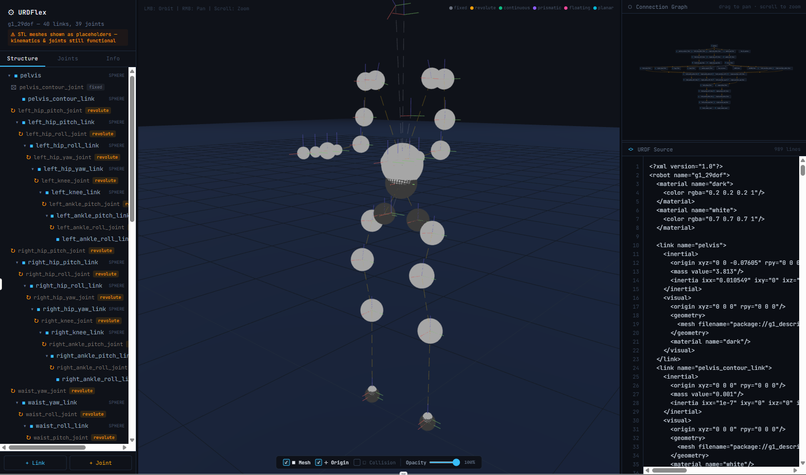

# URDFlex --- A web-based URDF viewer and editor

URDFlex is web-based URDF viewer and editor that allows you to visually check your URDF models. You can load your URDF model or start from the scratch.

## Usage

Just double click the `urdflex.html` and URDFlex will run in your browser.

## License

MIT